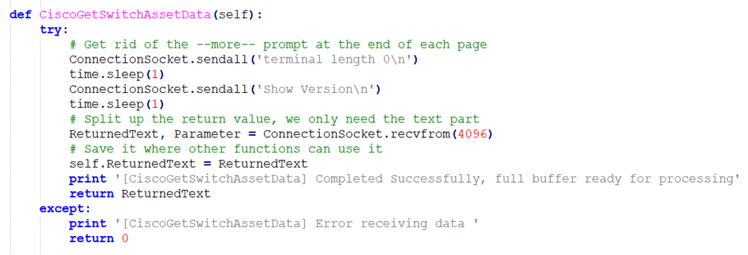

# Screen Scraping

If you do a **show version** command on a switch, it will return part numbers for all its internal components. Back in 2015 I needed to write a script to iterate through a network to find specific part numbers for power supplies (as there was a manufacturer’s recall on some that had an unfortunate tendency to spontaneously self-ignite).&#x20;

The enterprise equipment did not support YANG or NETCONF. To do the job properly required several hundred lines of Python code.&#x20;

In general terms, I had to write a function to do an SSH login where I could parse the prompts from the switch and send a username and password at the correct time. Then I needed to run a show version command and store the output.

<figure><figcaption></figcaption></figure>

Next, I had to search through the returned text for keywords and extract the responses based on the number of characters after the keywords; in the example, I am extracting the base MAC address of the unit as a unique identifier.

<figure><figcaption></figcaption></figure>

Every time CISCO make even a small change to the output text, my script will need to change. If I am going to accommodate both versions, I am going to have to capture the version number at the start of a session and use if statements in every affected function.&#x20;

In fairness, there is a Python library (expect) which could have made this a bit easier.&#x20;

Screen scraping is a truly horrible technique but was the only one available to us for many years. With conventional equipment, it may still be the only available way to carry out automation.

You may have guessed, I could also use this technique to configure equipment. Now I'm living dangerously!
